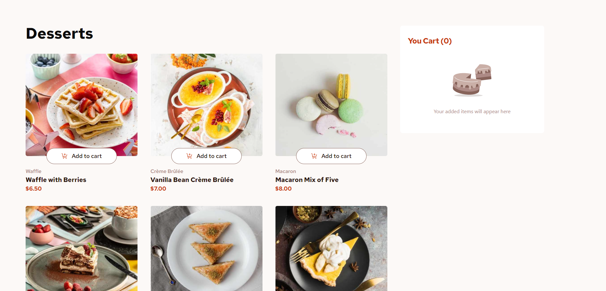
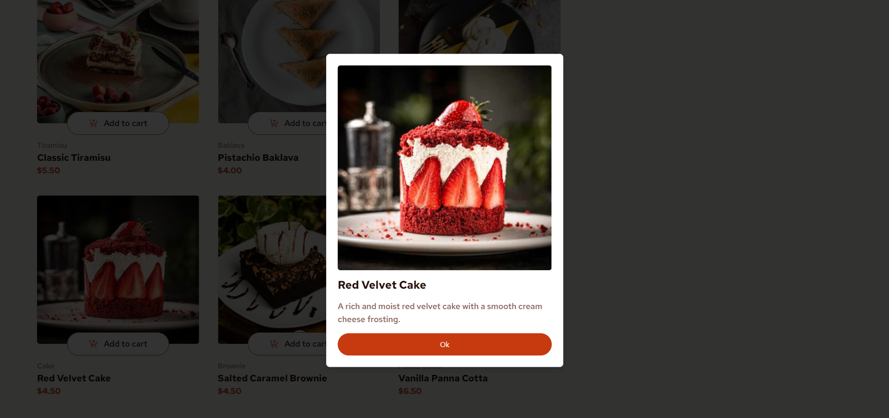
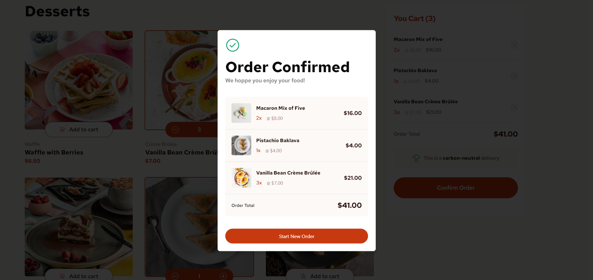
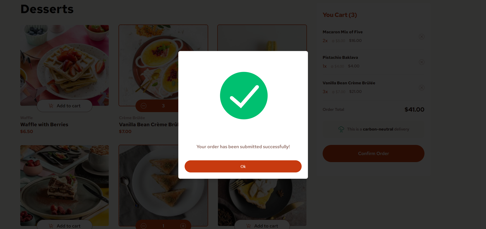
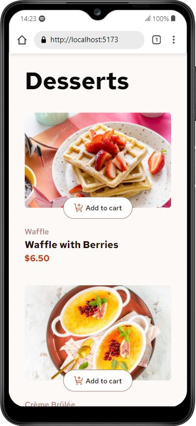
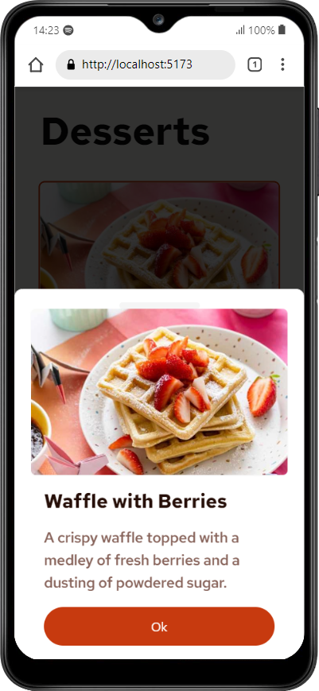
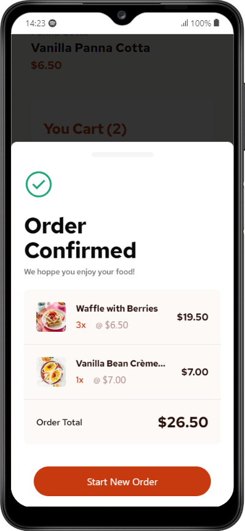

# Frontend Mentor - Product list with cart solution

This is a solution to the [Product list with cart challenge on Frontend Mentor](https://www.frontendmentor.io/challenges/product-list-with-cart-5MmqLVAp_d). Frontend Mentor challenges help you improve your coding skills by building realistic projects. 

## Table of contents

- [Overview](#overview)
  - [The challenge](#the-challenge)
  - [Screenshot](#screenshot)
- [My process](#my-process)
  - [Built with](#built-with)
  - [What I learned](#what-i-learned)
- [Author](#author)

## Overview

### The challenge

Users should be able to:

- Add items to the cart and remove them
- Increase/decrease the number of items in the cart
- See an order confirmation modal when they click "Confirm Order"
- Reset their selections when they click "Start New Order"
- View the optimal layout for the interface depending on their device's screen size
- See hover and focus states for all interactive elements on the page

### Screenshot

    
    
    
    
    
    
    
  

## My process

### Built with

- Semantic HTML5 markup
- Flexbox
- CSS Grid
- Responsive design
- [React](https://reactjs.org/) - JS library
- [Vite.js](https://vitejs.dev/) - React build tool
- [Tailwind](https://tailwindcss.com/) - For styles
- [Shadcn ui](https://ui.shadcn.com/) - For custom components
- [Zustand](https://zustand-demo.pmnd.rs/) - For state management

### What I learned

During the development of this project, I was able to practice using Zustando a little more to manage application states.

## Author

- [Portfolio](https://www.oedsonlucas.com.br/)
- [Linkedin](https://www.linkedin.com/in/edson-lucas-bd/)
